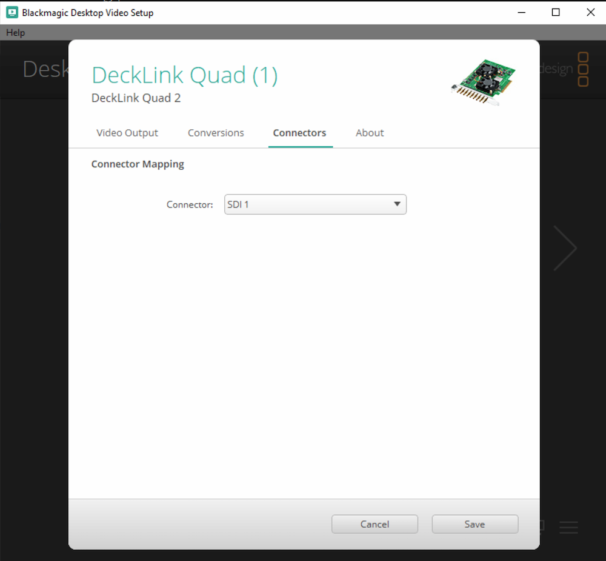
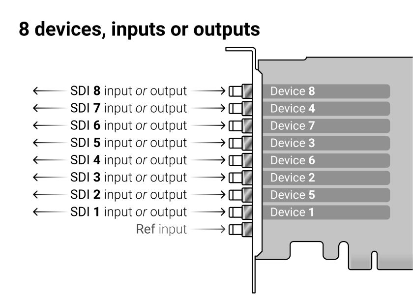
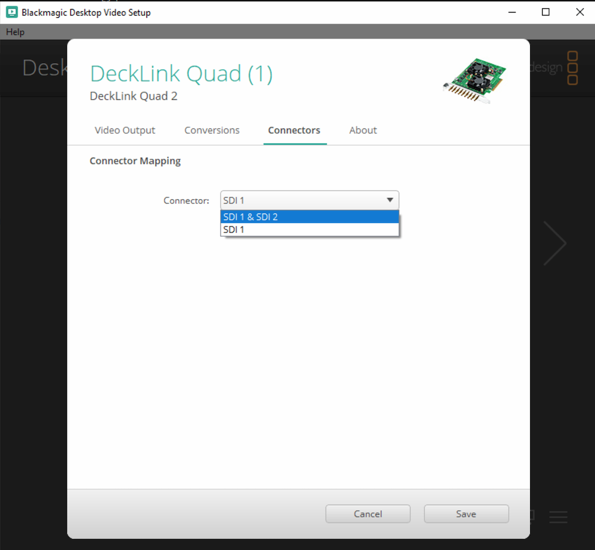
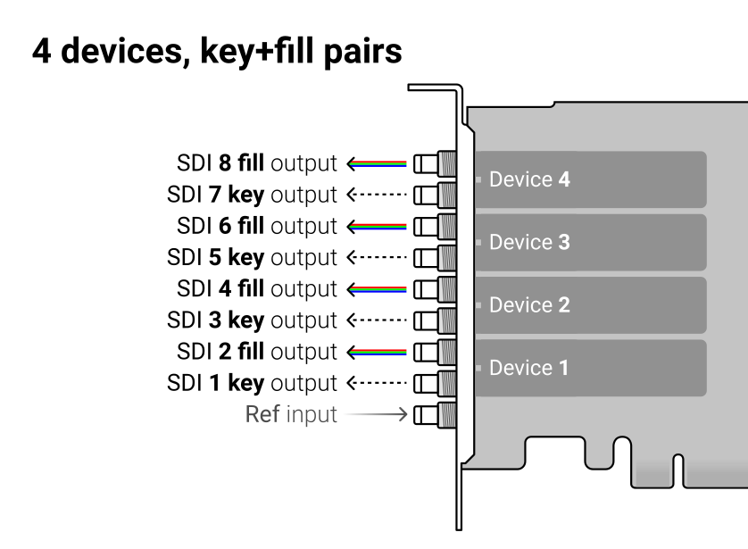
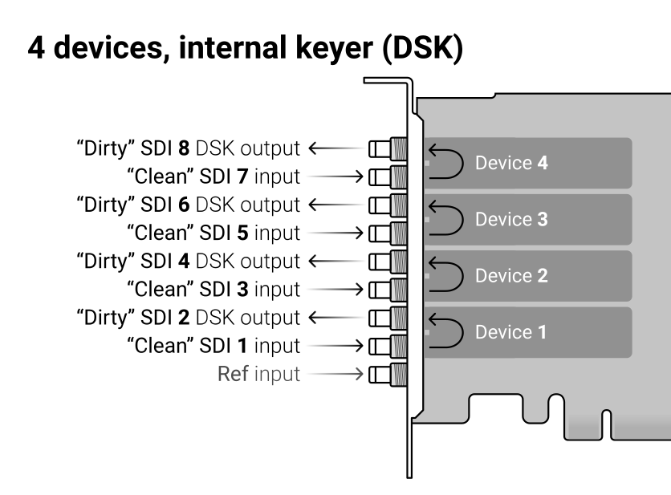
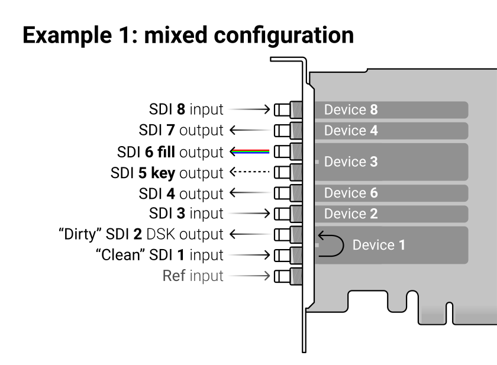

**Important:** Applies to _Duo 2_ and _Quad 2_ card. Some other card models (newer than _Duo 2_/_Quad 2_) might have the same architecture, but anything older than _Duo 2_/_Quad 2_ will **not** work as described below.

**In this document we will be using the _Decklink Quad 2_ as an example**, meaning we will describe having 8 configurable devices.

**Our examples shows usage together with CasparCG**. However, the device-mapping will work similarly with software like _vMix_ and _OBS_.

**Tip:** The `Ref` input connector (used for _Genlock_ or _Tri-level_) will always be located closest to the motherboard. In most PC tower cabinets that means that the card itself is mounted upside-down, which also means that you can locate the SDI ports left-to-right, starting with `Ref`, or bottom-up for rack-mounted cabinets (without PCI raisers).

## Understanding Devices and their modes

The biggest source of confusion comes from the relation between the physical SDI I/O ports and the inputs and outputs exposed to the software that will be using it. The confusion comes from the card's flexibility to operate in multiple modes. Start by considering that all SDI I/O can be switched from inputs to outputs, which makes it a challenge to draw wire diagrams without having a plan for how the card will be used in a specific setup.

The software interfaces with the card through an abstraction named a `Device`. Configuring the card through the _Desktop Video Software_ (found in the _Windows Control Panel_) decides how many devices it exposes, how they work, and if they are used as inputs or not.

### "Single-connector devices"

The _Quad 2_ card has 8 devices, but only if they all are configured as "Single connector". Each of the 8 `single-connector devices` can be used by the software as either an input, or an output.



The software addresses the device, and it is important to understand how the devices map to the physical SDI I/O. As the software will read the devices in their order, please observe how the physical SDI ordering is interleaved: SDI 1, 2, 3, 4, 5, 6, 7, 8 appears as devices 1, 5, 2, 6, 3, 7, 4, 8.

> The illustration below shows how `SDI 1` appears as `device 1` to the software, but `SDI 2` appears as `device 5`.



### "Dual-connector devices"

The 8 devices actually consist of 4 pairs of 2 devices. The pairs are devices 1+5, 2+6, 3+7, 4+8. Looking at it as physical SDI I/O, this actually means SDI 1+2, 3+4, 5+6 and 7+8 due to the interleaved layout of the devices.

Each of the devices 1, 2, 3, 4 can be set as "Dual-Connnector". Doing this consumes the associated devices (5, 6, 7, 8), which will disappear from the system, effectively stops the connectors being exposed in the software.



## Outputs in CasparCG (single-connector)

Any device can be configured to be an output. A CasparCG channel can have multiple `Decklink consumers`, and they will all show the same content. The channel's `video-mode` will be set as the format of the Decklink device by CasparCG.

```xml
<channel>
    <video-mode>1080i5000</video-mode>
        <consumers>
            <decklink>
                <device>2</device>
        </decklink>
    </consumers>
</channel>
```

In this example we'll assume this is the first `channel` tag in the config, which makes this `channel 1` for CasparCG. Adding `device 2` as a consumer means the channel will play on `SDI 3`, given that device 2 is set up with a single-connector in the first place.

> **Note:** Consumers can also be added runtime through the AMCP [ADD](../wiki/protocols/amcp-protocol.md#add) command.

> **Important:** As you will see with [Key+fill outputs](#keyfill-outputs-in-casparcg-dual-connetor), `device 2` will actually output on `SDI 4` when in a dual-connector mode, and `SDI 3` will then show the key-signal.

## Inputs in CasparCG (single-connector)

Any device that's not already being used as a consumer can be added as an input, also known as a `producer`.

Example AMCP command:

    PLAY 1-10 DECKLINK DEVICE 5 FORMAT 1080I5000

> In this example we will play `device 5` as an input on CasparCG `channel 1, layer 10`. For this to work, please make sure that:
>
> - `Device 1` is set as a single-connector ("SDI 1") and not a dual-connector ("SDI 1 & SDI 2"). Only then `device 5` is actually available to the software.
> - `Device 5` is not already being used as an output (consumer) by any software.
> - Your input is connected to `SDI 2`.

**Note:** `FORMAT` is optional in the `PLAY`-command, but can be used to play inputs of other video-formats that the channel is currently running on. For example `FORMAT 720p5000` on a channel with `<video-mode>1080i5000</video-mode>`. For more information, see the AMCP [PLAY](../wiki/protocols/amcp-protocol.md#play) command.

**Note:** @todo: Add documentation on default producers in config once merged: [PR 1315](https://github.com/CasparCG/server/pull/1315)

## Key+Fill outputs in CasparCG (dual-connetor)

Similar to [a single SDI output](#outputs-in-casparcg-single-connector), you can only address a single device in the consumer of a channel. Since CasparCG always operate with RGBA internally, you don't have to explicitly state that you want to produce a key+fill output. By setting the device as a dual-connector, it will work without any changes to the CasparCG config:

```xml
<channel>
    <video-mode>1080i5000</video-mode>
        <consumers>
            <decklink>
                <device>2</device>
        </decklink>
    </consumers>
</channel>
```

> **Note:** In this example we have to make sure that `device 2` is set as a dual-connector ("SDI 3 & SDI 4"). This will give `key` on `SDI 3` and `fill` on `SDI 4`.



## Internal keying in CasparCG (dual-connector)

Instead of outputing a key+fill pair to use for keying in a separate vision mixer, the Quad 2 has the ability to do they keying internally.

```xml
<channel>
    <video-mode>1080i5000</video-mode>
        <consumers>
            <decklink>
                <device>2</device>
                    <keyer>internal</keyer>
        </decklink>
    </consumers>
</channel>
```

> In this example, with the property `<keyer>internal</keyer>` we set `device 2` to expect a "clean" SDI input on `SDI 3` and anything playing on the CasparCG channel will be keyed/superimposed on top of this signal to come out "dirty" on `SDI 4`. Again, we have to make sure that `device 2` is set as a dual-connector ("SDI 3 & SDI 4").
>
> - All content (graphics, video and audio) will be added/keyed to the signal passing through.
> - Throughput latency for the signal will only be 1 frame.
> - The original content can still be captured by software, using `device 2` as an input.
> - The throughput signal can not be manipulated, only added to. To do DVE effects you need to capture the input to software, which adds latency accordingly (input + software + output). This also adds CPU/GPU load as the video will be processed by the software.
> - Keying with the internal keyer is a "cheap" operation, as the CPU/GPU only has to produce the content that goes on top, and the keying is offloaded to be done by the Decklink hardware.



## Example of a mixed configuration

Finally, an illustration showing that all modes can be combined. The only limitation to keep in mind is that "dual devices" are limited to 1, 2, 3 and 4, and all "dual devices" consumes their respective device to pair with.



> In this config CasparCG would use devices 1, 3, 4, 6 as outputs, and consume devices 2 and 8 as inputs.
