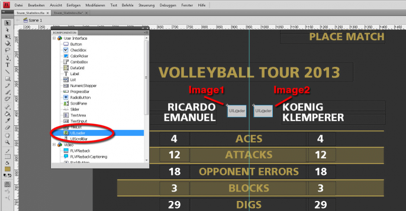
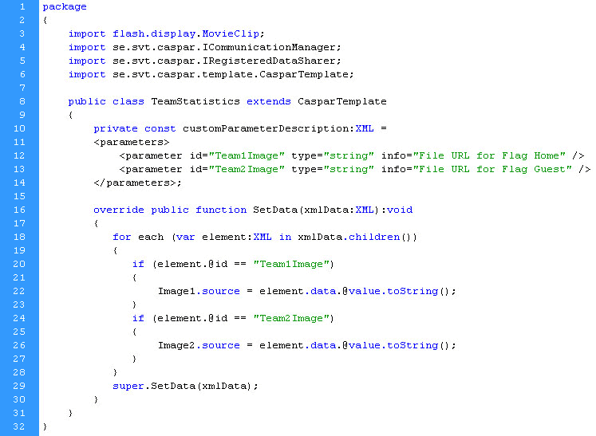

Getting a Flash template to load and dynamically display bitmaps from disk is very useful for lots of applications. Here's a quick explanation on how to display different flags in a volleyball scoreboard.

[Download the source files used for this tutorial](http://casparcg.com/wp-content/uploads/tutorials/Tutorial_Loading_Dynamic_Images_in_Flash_Templates.zip).


Open the _Team_Statistics.fla_ file in Flash Professional, and you can see that the dynamic text fields are just normal dynamic text with an instance name. The flags are UILoader components:



Open the _Component window_ (Ctrl+F7) and create two UILoaders and place and size them correctly. Remember to give them individual and unique instance names. In the example project they are called Image1 and Image2, respectively.

Then create a new ActionScript file and let it extend _CasparTemplate_ and let the animation point to the class like this:


Please refer to [Guide: Creating Advanced Flash Templates](./creating-advanced-flash-templates) for further details about extending _CasparTemplate_.

In the ActionScript file _TeamStatistics.as_ (place it in the folder as the .fla file) you have to have at least the following code (the text is available in the source files.)



Important in the above code is line 20 and 24 respectively, where the green texts are the variable names of the images. Use these variable names to send the image filenames to the template. In line 22 and 26 respectively, the UILoader components get their source property set to the name of the file. All the other dynamic text fields get their data to the call on line 29.

Finally, you have to send the template variables formatted as a correct URL. The file path

```
D:\Beach_Volley\World_Flags_2013\World_Flags_BIG_40px\Switzerland.png
```

...should be entered as:

```
file:///D:/Beach_Volley/World_Flags_2013/World_Flags_BIG_40px/Switzerland.png
```
