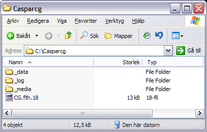

All configuration of CasparCG Server is done in the text file `caspar.config` which can be edited in any text editor. If you want to change the location (for example to a faster disk) you just change the paths in the `casparcg.config` file.

Use the `\` character in front of any special character, so that C:\CasparCG\ is written `C:\\CasparCG\\`

At the bottom of the `casparcg.config` file you will find comments which document additional settings.

## Paths Configuration



To tell the CasparCG Server where to look for media files, change the following paths in the configuration file.

You can change these paths to any path you'd like, for example a fixed path such as `L:\\CasparCG\\` or `\\\\my-server\\` or even a relative path (calculated from the Server's EXE file) such as `Media sub-folder\\` Please note: All paths should be terminated with a backslash (meaning that it should be entered as `\\`).

We recommend that you place your media and templates files locally, on a fast disk that is not the same disk used for the operating system.

- log-path: Path to folder with all logs.
- media-path: CasparCG Server will look in the media folder (and its sub folders) for videos, audio and images files.
- template-path: CasparCG Server will look in the templates folder (and its subfolders) for Flash templates.
- template-host: Path to Flash TemplateHost files.
- data-path: Path to folder where "data" is read from and written to. CasparCG Server will look in the data folder (and its sub folders) for data loaded by Flash templates.

```xml
<configuration>
...
 <paths>
    <media-path>C:\\casparcg\\_media\\</media-path>
    <log-path>C:\\casparcg\\_log\\</log-path>
    <data-path>C:\\casparcg\\_data\\</data-path>
    <template-path>C:\\casparcg\\_templates\\</template-path>
    <template-host>cg.fth.20</template-host>
 </paths>
...
</configuration>
```

## log

Available in version 2.1.0 onwards. Allows a remote client to monitor the Caspar CG Server log by connecting to the defined port, if added to the config file in the controllers section as shown below (other controllers not shown.

```xml
<controllers>
 ...
 <tcp>
  <port>3250</port>
  <protocol>LOG</protocol>
 </tcp>
</controllers>
```

Implemented by [hellgore](http://github.com/HellGore) in this [commit](http://github.com/CasparCG/Server/commit/5fb7f47b0a34ae5bc89207bf3172d15e06c86430)

## log-level

Increase or decrease the amount of logging.
Options are:

- error
- warning
- info
- debug
- trace

```xml
<configuration>
...
  <log-level>info</log-level>
...
</configuration>
```

## diagnostics

The diagnostics window can be opened using the AMCP command `DIAG`

Graphs option determines whether the diagnostics window will display graphs or not.

```xml
<diagnostics>
 <graphs>true [true|false]</graphs>
</diagnostics>
```

See graph descriptions for more information about interpreting diagnostic graphs.

## Auto-Mode

CasparCG Server 2.0 supports automatic real-time conversion of video-files encoded in other video modes than the channel is running.

Note: Auto-mode is highly dependent on that the clips are encoded correctly with frame-rate and interlacing meta-data.

```
 <auto-mode>[true|false]</auto-mode>
```

## Buffering

### buffer-depth

```xml
  <consumers>
     <buffer-depth>[2..]</buffer-depth>
  </consumers>
```

Buffer depth configures the depth of CasparCG Server's consumer buffers. Lower buffer-depth will decrease frame latency, however the software will be less tolerant to performance spikes.

Different consumers have different minimum buffer-depths to function properly. The buffer-depth setting should be set to the highest depth of any of the used consumers.

**It is recommended (but not required) to use a buffer-depth of 2 frames over minimum.**

| Consumer                         | Minimum buffer depth |
| -------------------------------- | -------------------- |
| Bluefish                         | 2                    |
| Decklink                         | 3                    |
| Decklink + emb audio             | 4                    |
| Decklink + low-latency           | 2                    |
| Decklink + emb audio low-latency | 3                    |
| Screen                           | 2                    |
| Audio                            | 3                    |

### pipeline-tokens

```xml
<pipeline-tokens>[2..]</pipeline-tokens>
```

The number of tokens that can be active in the rendering pipeline. Currently the pipeline has two parallel stages so for maximum performance you should have 2 tokens. Adding more than 2 tokens can provide buffering for hiding performance spikes. Each token causes a delay of 1 frame, so setting it to 25 causes the pipeline to render at maximum performance (since >=2) and then adds 23 frames of extra buffering.

Setting pipeline-tokens to 1 for a channel reduces the delay from input to output by 1 frame. Please note that reducing the delay/buffering can have impact on performance and spike tolerance.

## Channels Configuration

The resolution and frame rate of the channel must be specified.

```xml
 <channels>
   <channel>
     <video-mode> PAL [PAL|NTSC|576p2500|720p2398|720p2400|720p2500|720p29.976|720p30|720p5000|720p5994|720p6000|1080p2398|1080p2400|1080p2500|1080p2997|1080p3000|1080p5000|1080i5000|1080p5994|1080i5994|1080p6000|1080i6000|2160p2398|2160p2400|2160p2500|2160p2997|2160p30] </video-mode>
     <consumers>
     </consumers>
   </channel>
 </channels>
```

Please note that the 4K (3840x2160) support requires CasparCG Server 2.0.4 or later.

## Video Formats

These formats are supported in a channel, and can be configured either in the `caspar.config` file or via the `SET` command.

See also: Table of supported video cards

| Video Format (Parameter) | Frame Rate | Field order | Resolution (square pixels) | Resolution (non-square pixels) | Notes                                                |
| ------------------------ | ---------- | ----------- | -------------------------- | ------------------------------ | ---------------------------------------------------- |
| PAL                      | 50i        | Upper/Odd   | 1024x576                   | 720x576                        |
| NTSC                     | 59.94i     | Lower/Even  | 720x540                    | 720x486                        |
| 576p2500                 | 25p        | Progressive | 1024x576                   |                                | Not supported by output cards from BlackMagic Design |
| 720p2398                 | 23.976p    | Progressive | 1280x720                   |                                | Not supported by output cards from BlackMagic Design |
| 720p2400                 | 24p        | Progressive | 1280x720                   |                                | Not supported by output cards from BlackMagic Design |
| 720p2500                 | 25p        | Progressive | 1280x720                   |
| 720p2997                 | 29.976p    | Progressive | 1280x720                   |                                | Not supported by output cards from BlackMagic Design |
| 720p3000                 | 30p        | Progressive | 1280x720                   |                                | Not supported by output cards from BlackMagic Design |
| 720p5000                 | 50p        | Progressive | 1280x720                   |
| 720p5994                 | 59.94p     | Progressive | 1280x720                   |
| 720p6000                 | 60p        | Progressive | 1280x720                   |
| 1080p2398                | 23.976p    | Progressive | 1920x1080                  |
| 1080p2400                | 24p        | Progressive | 1920x1080                  |
| 1080p2500                | 25p        | Progressive | 1920x1080                  |
| 1080p2997                | 29.976p    | Progressive | 1920x1080                  |
| 1080p3000                | 30p        | Progressive | 1920x1080                  |
| 1080p5000                | 50p        | Progressive | 1920x1080                  |
| 1080i5000                | 50i        | Upper/Odd   | 1920x1080                  |
| 1080p5994                | 59.94p     | Progressive | 1920x1080                  |
| 1080i5994                | 59.94i     | Upper/Odd   | 1920x1080                  |
| 1080p6000                | 60p        | Progressive | 1920x1080                  |
| 1080i6000                | 60i        | Upper/Odd   | 1920x1080                  |
| 2160p2398                | 23.976p    | Progressive | 3840x2160                  |                                | 4K support requires CasparCG Server 2.0.4 or later.  |
| 2160p2400                | 24p        | Progressive | 3840x2160                  |                                | 4K support requires CasparCG Server 2.0.4 or later.  |
| 2160p2500                | 25p        | Progressive | 3840x2160                  |                                | 4K support requires CasparCG Server 2.0.4 or later.  |
| 2160p2997                | 29.976p    | Progressive | 3840x2160                  |                                | 4K support requires CasparCG Server 2.0.4 or later.  |
| 2160p3000                | 30p        | Progressive | 3840x2160                  |                                | 4K support requires CasparCG Server 2.0.4 or later.  |
| 2160p5000                | 50p        | Progressive | 3840x2160                  |                                | HFR 4K requires CasparCG Server 2.1.0b2 or later.    |
| 2160p5994                | 59.94p     | Progressive | 3840x2160                  |                                | HFR 4K requires CasparCG Server 2.1.0b2 or later.    |
| 2160p6000                | 60p        | Progressive | 3840x2160                  |                                | HFR 4K requires CasparCG Server 2.1.0b2 or later.    |

## Consumers Configuration

Consumer configuration lives within the consumers section of a channels configuration.

```xml
<channel>
 <consumers>
 ..
 </consumers>
</channel>
```

### `<decklink>`

Please note: This applies to all supported cards from BlackMagic Design, not just their DeckLink product range.

```xml
 <decklink>
    <device>[1..]</device>
    <embedded-audio>false [true|false]</embedded-audio>
    <latency>default [normal|low|default]</latency>
    <keyer>external [external|internal|default|external_separate_device]</keyer>
    <key-only>false [true|false]</key-only>
    <buffer-depth>3 [1..]</buffer-depth>
    <key-device>device + 1 [1..]</key-device>
 </decklink>
```

From v2.0.7 Beta 2 onwards, it is possible to use a separate Decklink device (note that this could be a separate device on the same physical card) to produce a key signal if required, prior to this version, a Decklink card with a separate key facility (such as the HD Extreme) was required. To use another device as a key signal, set `<key-device>` to the device to be used to output a key signal, and set `<keyer>` to `external_serparate_device`.

### `<bluefish>`

```xml
 <bluefish>
   <device>[1..]</device>
   <embedded-audio>false [true|false]</embedded-audio>
   <key-only>false [true|false]</key-only>
 </bluefish>
```

### `<screen>`

```xml
 <screen>
   <device>[0..]</device>
   <aspect-ratio>default [default|4:3|16:9]</aspect-ratio>
   <stretch>fill [none|fill|uniform|uniform_to_fill]</stretch>
   <windowed>false [true|false]</windowed>
   <key-only>false [true|false]</key-only>
   <auto-deinterlace>true [true|false]</auto-deinterlace>
   <vsync>false [true|false]</vsync>
   <name>[Screen Consumer]</name>
   <borderless>false [true|false]</borderless>
 </screen>
```

### `<name>`

Allows the title bar label to be changed, if not, Caspar CG will generate one containing information about the channel and its format.

### `<borderless>`

Windows title bar and border around the window will no longer be visible, this is most useful for developers writing applications to run on the same machine as Caspar CG Server where the screen consumer can then be embedded into the application.

### `<newtek-ivga>`

Allows the NewTek TriCaster series of vision mixers to receive input from Caspar CG via network (note, from v2.0.7 Beta 2 onwards, driver also required, see System Requirements)

```xml
<newtek-ivga>
  <channel-layout>stereo [mono|stereo|dts|dolbye|dolbydigital|smpte|passthru]</channel-layout>
  <provide-sync>true [true|false]</provide-sync>
</newtek-ivga>
```

### `<file>`

```xml
<file>
 <path></path>
 <vcodec>libx264 [libx264|qtrle]</vcodec>
 <separate-key>false [true|false]</separate-key>
</file>
```

### `<stream>`

From v2.0.7 Beta 2 onwards. Renamed to [`<ffmpeg>`](#ffmpeg) since v2.1.x.

### `<ffmpeg>`

The below is an example usage for the streaming consumer configuration, there are no defaults for this consumer

```xml
<ffmpeg>
 <path>udp://localhost:5004</path>
 <args>-codec:v libx264 -tune:v zerolatency -preset:v ultrafast -crf:v 25 -format mpegts -filter:v scale=240:180</args>
</ffmpeg>
```

**NB:** ffmpeg arguments must be provided in the form '-[parameter]:[stream]', eg. -codec:v, not -vcodec, -filter:v, not -vf. Incorrect syntax will yield an "Unused option" warning in logs.

Certain configuration elements applicable to multiple consumers are explained below in a little more detail.

### `<device>`

Chooses which device to use if you have several of the same kind. Devices identified by Caspar are listed at the top of the console on start-up (not that this will not be displayed if Caspar is set to log warnings and above only) with a number in square brackets next to them. This number is the device number that should be used here.

```xml
<device>[1..]</device>
```

### `<embedded-audio>`

Turning on embedded audio for a channel adds a delay of 1 frame. Default is false.

```xml
<embedded-audio>false [true|false]</embedded-audio>
```

### `<latency>`

Setting latency to low for a channel reduces delay by 1 frame. Can have impact on performance and spike tolerance.

```xml
<latency>default [normal|low|default]</latency>
```

### `<system-audio>`

Enables output through the default audio device of your hardware. This should be applied to the `<consumers>` section, not to an individual consumer, for instance:

```xml
<consumers>
 <screen>
  ..
 </screen>
 <system-audio>false [true|false]</system-audio>
</consumers>
```

## Configuration Examples

### How to enable the Screen Consumer

Open the `casparcg.config` in a text editor and use the following node for consumers:

```xml
 <consumers>
 	<screen/>
 </consumers>
```

### How to enable the DeckLink Consumer

To get video in and key output, open `casparcg.config` in a text editor and use the following node for consumers:

```xml
<consumers>
	<decklink/>
</consumers>
```
