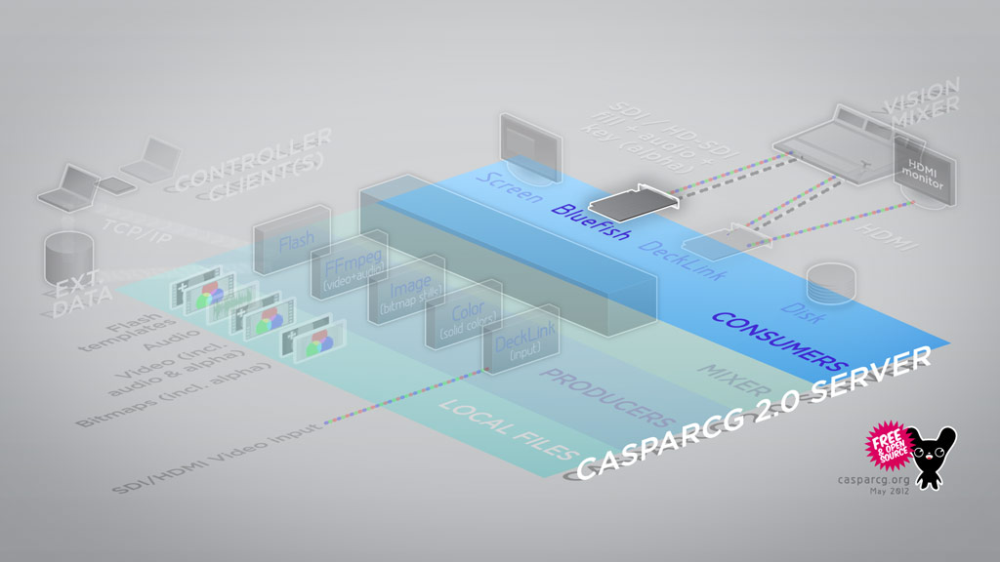

Outputs the playing media on to video cards from Bluefish Technologies with full SDI support for all SD and HD resolutions, frame rates, pixel aspect ratios, including support for separate fill and key channels + audio.

## Availability

2.0 - 2.1 and 2.3 onwards. Not available in 2.2

## Multiple Cards

You can install multiple Bluefish cards in a single machine. Each card will be addressed with a unique ID, making it possible have several independent outputs from one server.

## Automatic Conversion of Output Levels

To comply with broadcast standards such as [CCIR 601](http://en.wikipedia.org/wiki/CCIR_601) and [Rec. 709](http://en.wikipedia.org/wiki/Rec._709) the 0-255 RGB levels rendered by the producers is automatically converted to the correct broadcast format (for example a range of 16-235) by the Bluefish Consumer based on the setting in the Bluefish Feature App.

## Genlock

Genlock is supported with this consumer.

## Audio

Audio can either be played out by the default Windows audio device, or embedded in the SDI output.
