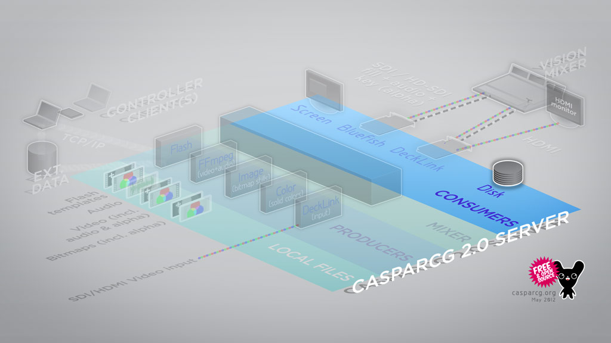

The FFmpeg consumer forwards the output of a CasparCG channel to ffmpeg, to stream or record video.

If you are familiar with FFmpeg, you will feel somewhat at home with the commands; the consumer tries to mimic the command-line arguments used by FFmpeg.

**Note**: Caspar will only take arguments in the -[parameter]:[stream] syntax. Use -codec:v, not -vcodec. Arguments not passed on by caspar to FFmpeg will yield an "Unused option" log message.

The encoding will take advantage of multi-core CPUs.

Time code is currently not supported. To enable playback of a file as it is being recorded, you must use a multiplexer format which supports this. Examples include MXF, MPEG2-PS or MPEG2-TS.

### Video format

The video and audio is passed from CasparCG to the FFmpeg consumer at CasparCGs internal data format, which is 4:4:4 RGBA.

It is therefore often necessary or advisable to adapt the raw video to a format appropriate for encoding by use of an FFmpeg filter chain; eg. `-filter:v format=yuv420p`.

Users have to take care of color mode, color space, range, picture format, picture size, aspect ratio, samplesize, samplerate, channel configuration (...) using a valid filter chain. Otherwise you may get unexpected results or somehow "broken files".

### Statically configured example

Inside the `<consumer>` tag of casparcg.config, this example will yield a low-latency stream sent to the local host.

```xml
<ffmpeg>
 <path>udp://localhost:5004</path>
 <args>-codec:v libx264 -tune:v zerolatency -preset:v ultrafast -crf:v 25 -format mpegts -filter:v scale=720:-2</args>
</ffmpeg>
```

### Run-time example

**Note:** The server returning "ADD OK" means only that the command has been received and a consumer has been created. _It does not indicate that FFmpeg has actually successfully started_. If you are experiencing problems, check the server log files. A quick way to check whether FFmpeg actually did start, is removing the stream. If you get "404 REMOVE FAILED" back, the consumer died on its own; check the logs for details.

For historical/compatibility reasons, STREAM and FILE are interchangeable.

This command will generate a MOV file with H.264/AAC, scaled to 1280x720p50 4:2:0.

```
ADD 1-1 FILE myfile.mov -codec:v libx264 -codec:a aac -filter:v scale=width=1280:height=720:out_matrix=bt709:out_range=full,format=yuv420p,fps=50
```

The container format will be deduced from the file extension, but can be manually specified using -format. See [FFmpeg output format documentation](https://ffmpeg.org/ffmpeg-formats.html#Muxers) for a list of output formats (muxers) and their arguments.

To stop the recording you simply type:

```
REMOVE 1-1 FILE
```
