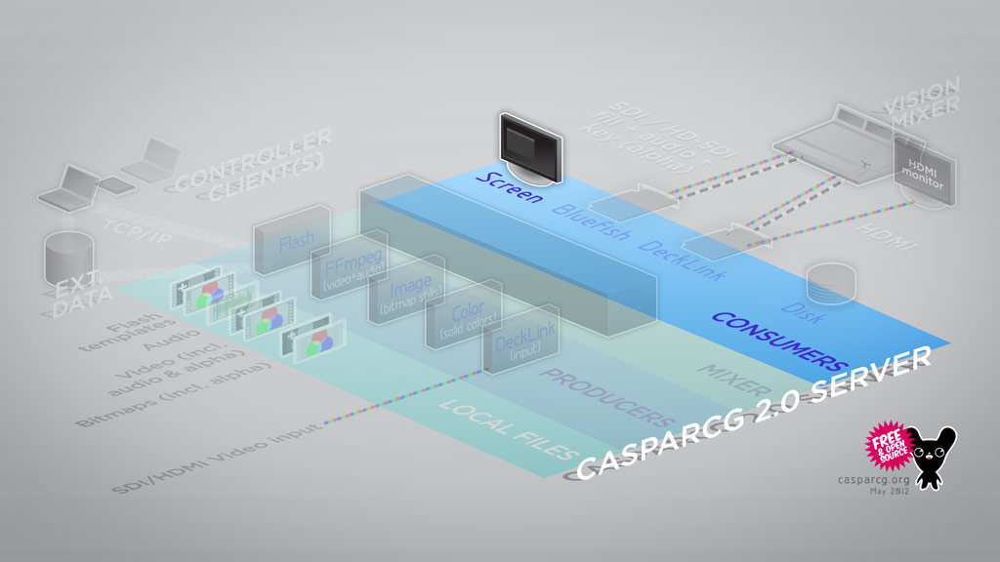

The Screen Consumer outputs to either a window or fullscreen to one or several computer monitors attached directly to the hardware running the CasparCG Server software.

## How to Use

Open the casparcg.config in a text editor and enter the following node for consumers:

```
<consumers>
    <screen/>
</consumers>
```

## Quirks

- When always-on-top is enabled, the window is not guaranteed to be on top, not all linux desktop environments are guaranteed to respect the request. Additionally some OS components such as taskbar, start menu, alt-tab overlay may still draw on top. This may also vary on linux depending on the desktop environment used.
