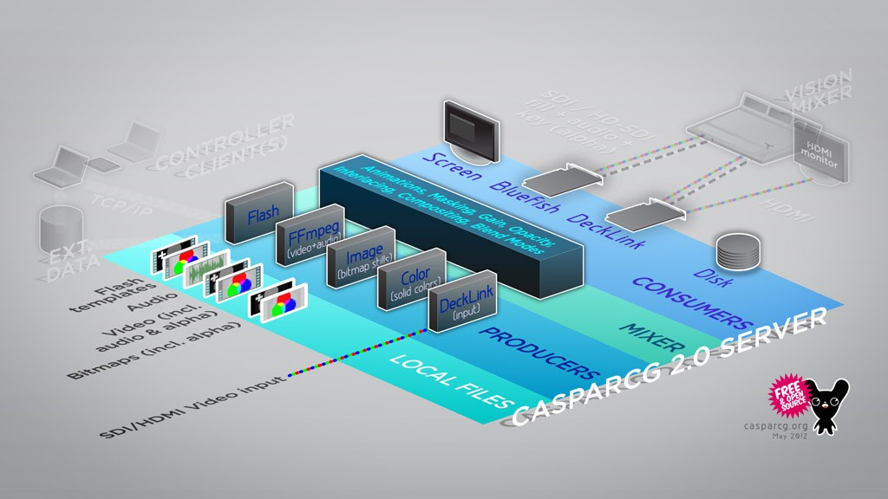

1. Input: [Producers](./producers/index.md) read, render and play content such as videos, animations, images and audio to a frame (and/or audio) buffer, known as a layer.

1. Transform: The [Mixer](./mixer.md) Module takes the layers from one or several producers and performs various video and audio transformations such as color transforms, de-interlacing, scaling, transitions, image adjustments and audio adjustments on each layer before compositing them together (and optionally re-interlace them.)

1. Output: [Consumers](./consumers/index.md) then receive the composited frames and displays them on a specified output, for example a window on the computer monitor or an SDI card.
   All functionality is controlled via network commands sent with the [AMCP](../protocols/amcp-protocol.md) Protocol, either by the CasparCG Client Software, or by your own custom software or a command prompt.
