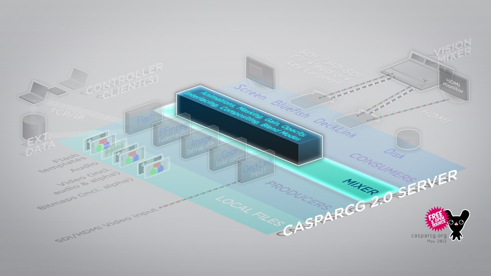

The Mixer module is where content from one (or several) producers is stacked, transformed and composited before being sent to one or several consumers.

Please see the AMCP Mixer commands section for a complete reference of the AMCP commands used to control this module.

## Compositing

All media played by any producers can be composited (stacked on top of each other) using either the media's built-in in alpha channel or by using the alpha channel of another media file (for example: using one video to cut a whole in another video.) The layers are numbered from 0 upward, with layer 0 as the bottom-most layer in the composite.

## Transforms

The `MIXER` module can perform a number of real-time transforms to individual layers, by using the GPU.

### Position

The position of each layer can be set individually, and this value can also be automatically animated. This is a real-time effect, calculated on the GPU.

Please see `MIXER FILL` command.

### Scaling

The scale of each layer can be set individually in both X and Y axis, and this value can also be automatically animated. This is a real-time effect, calculated on the GPU.

Please see `MIXER FILL` command.

### Rotation

Rotation is supported through the `MIXER ROTATION` command from version 2.0.7 stable.

## Image Adjustments

The `MIXER` module can perform a number of real-time adjustments to layers, by using the GPU.

### Blend Modes

Every layer in the Mixer module can be set to a blend mode over than the default Normal mode, similar to applications like Photoshop. Some common uses are to use screen to make a all the black image data become transparent, or to use add to selectively lighten highlights.

Please see `MIXER BLEND` command and the supported Blend Modes.

### Opacity

The alpha channel of each layer can be set to a specific opacity value in order to change the transparency. The value can also be automatically animated. This is a real-time effect, calculated on the GPU.

Please see `MIXER OPACITY` command.

### Brightness

The brightness of the content (RGB) of each layer can be adjusted in real-time on the GPU. The value can also be automatically animated.

Please see `MIXER BRIGHTNESS` command.

### Saturation

The color saturation of the content (RGB) of each layer can be adjusted in real-time on the GPU. The value can also be automatically animated.

Please see `MIXER SATURATION` command.

### Contrast

The contrast of the content (RGB) of each layer can be adjusted in real-time on the GPU. The value can also be automatically animated.

Please see `MIXER CONTRAST` command.

### Levels

The RGB levels of the content of each layer can be adjusted in real-time on the GPU. The values can also be automatically animated.

Please see `MIXER LEVELS` command.

## Masking

You can mask the alpha channel of each layer by scaling and clipping it, creating a rectangular mask.

The values can also be automatically animated, which can be useful to introduce an animation to a static layer such as an image, or to animate the alpha of a video loop to create an in- and out-animation.

Please see `MIXER CLIP` command.

## Generating Alpha Channel from Other Layer

The alpha channel of each layer is by default generated by each producer, using the embedded alpha channel of the content. You can override this and generate the transparency of a layer by using the alpha channel of another layer. That layer can be of any type, so you could generate the alpha channel from a Flash template, a video file (preferably a video file with an embedded alpha channel) or a bitmap image.

The position and scale values of the layer generating the alpha can also be automatically animated, which can be useful to introduce an animation to a static layer such as an image, or to animate the alpha of a video loop to create an in- and out-animation.

Please see `MIXER KEYER` command.

## Chroma keying

An approximate color (currently green or blue) can be used as transparency of a layer, when the image lacks alpha channel information. This allows for video/still footage taken using a green/blue screen to be keyed above other material.

Please see `MIXER CHROMA` command.

## Audio Adjustments

### Audio Volume

The audio volume of each layer played by the FFmpeg Producer (video and audio, but not Flash) can be adjusted in real-time. The value can also be automatically animated.

Please see `MIXER VOLUME` command.

### Master Volume

The audio volume of an entire channel can be adjusted in real-time (scaling the layer volumes accordingly).

Please see `MIXER MASTERVOLUME` command.

## Blend Modes

Every layer in the Mixer module can be set to one of these blend modes. Some common uses are to use screen to make a all the black image data become transparent, or to use add to selectively lighten highlights.

- Normal (default)
- Lighten
- Darken
- Multiply
- Average
- Add
- Subtract
- Difference
- Negation
- Exclusion
- Screen
- Overlay
- Soft_Light
- Hard_Light
- Color_Dodge
- Color_Burn
- Linear_Dodge
- Linear_Burn
- Linear_Light
- Vivid_Light
- Pin_Light
- Hard_Mix
- Reflect
- Glow
- Phoenix
- Contrast
- Saturation
- Color
- Luminosity

## Animation Types

The following list specifies all supported tweens. You can also see a preview of the animation types.

- linear (default)
- easenone
- easeinquad
- easeoutquad
- easeinoutquad
- easeoutinquad
- easeincubic
- easeoutcubic
- easeinoutcubic
- easeoutincubic
- easeinquart
- easeoutquart
- easeinoutquart
- easeoutinquart
- easeinquint
- easeoutquint
- easeinoutquint
- easeoutinquint
- easeinsine
- easeoutsine
- easeinoutsine
- easeoutinsine
- easeinexpo
- easeoutexpo
- easeinoutexpo
- easeoutinexpo
- easeincirc
- easeoutcirc
- easeinoutcirc
- easeoutincirc
- easeinelastic
- easeoutelastic
- easeinoutelastic
- easeoutinelastic
- easeinback
- easeoutback
- easeinoutback
- easeoutintback
- easeoutbounce
- easeinbounce
- easeinoutbounce
- easeoutinbounce
