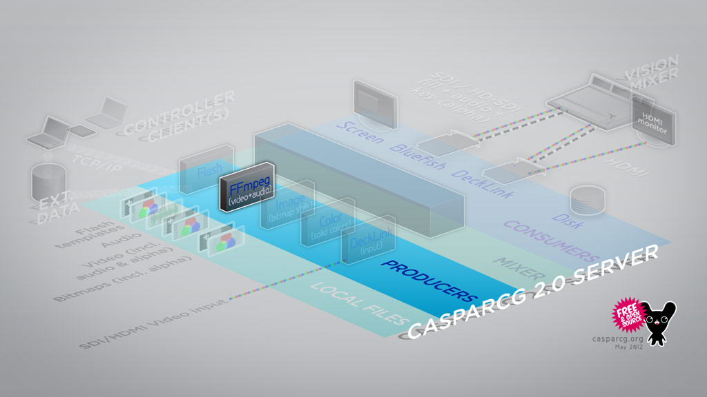

## Supported Media

The FFmpeg Producer can play all media that FFmpeg can play, which includes many QuickTime video codec such as Animation, PNG, PhotoJPEG, MotionJPEG, as well as H.264, FLV, WMV and several audio codecs as well as uncompressed audio.

The FFmpeg Producer can also play from direct show devices such as USB cameras connected to the server.

Please see the AMCP commands section for a complete reference of the AMCP commands used to control this module.

## File Path

All files played by this producer must be placed in the \_Media sub folder, by default C:\CasparCG_Media

## Transitions Between Videos

You can play two simultaneous video files from disk to the same consumer during any of the built-in transitions such as mix, wipe, push and slide of a user-selectable number of frames. If your video files have alpha channel (key) those will work as well.

## Sending FFmpeg-specific parameters

The FFmpeg producer supports “libavfilter” filters through the `FILTER` parameter in the `LOADBG` command.

## File Naming

Even though most producers support Unicode characters, there are some limitations in the FFmpeg Producer that causes media not to be found if it contains less common characters and even spaces. This can be avoided by always enclosing file names in quotation marks when they are being sent in AMCP commands, or by avoiding them when naming the files.

Recommended: Show-Titles_A_03_Upper_Alpha.mov

Can cause problems in FFmpeg Producer if commands are not enclosed in quotation marks: Show Titles A 03 Upper Alpha.mov

## AMCP Command

The general format of the AMCP command is:

```
PLAY <channel>-<layer> <resource> <parameters> ...
```

channel is the output channel on which to play the resource.

layer is the channel layer on which to play the resource.

resource is a resource identifier. This can be a filename, or a URI like specification such as "dshow://video=Some Camera" which will open the USB camera 'Some Camera' connected to the CasparCG server.

## AMCP Parameters

### LOOP

```
{LOOP}
```

If this parameter is sent with either `LOADBG`, `LOAD`, `PLAY` or `CALL`, the file will automatically loop.

Example:

```
PLAY 1-1 MOVIE LOOP
```

### SEEK

```
SEEK [frames:int]
```

Currently only supported for video files, not audio files.

If this parameter is sent with either `LOADBG`, `LOAD`, `PLAY` or `CALL` it sets the start of the video file, in frames. This producer will instantly start playing at this point.

Example:

```
PLAY 1-1 MOVIE SEEK 100 LOOP
```

### START

```
START [frames:int]
```

Introduced in CasparCG Server 2.1. Currently only supported for video files, not audio files.

Sets the start of the file in milliseconds. This point will be used as the starting point while looping.

Example:

```
PLAY 1-1 MOVIE START 100 LOOP
```

### LENGTH

```
LENGTH [frames:int]
```

Currently only supported for video files, not audio files.

Sets the end point (the last frame that will be played or the end loop point.)

Example:

```
PLAY 1-1 MOVIE LENGTH 100
```

### FILTER

```
FILTER [libavfilter-parameters:string]
```

Configures which libavfilter will be used.

Example:

```
PLAY 1-1 MOVIE FILTER hflip:yadif=0:0
```

A complete list of filters and a description of their purpose can be found here [http://libav.org/libavfilter.html#Video-Filters](http://libav.org/libavfilter.html#Video-Filters)

## AMCP Functions

### LOOP

```
LOOP [loop:0|1]
```

Sets whether file will loop or not.

Returns the value of `LOOP` after the command has completed.

Examples:

```
CALL 1-1 LOOP 1
```

Enables the looping on 1-1.

```
CALL 1-1 LOOP
```

Queries the parameter value, without changing it.

### SEEK

```
SEEK [REL|IN|OUT|END] [frames:int]
```

Seeks in the file.

Currently only supported for video files, not audio files.

If two parameters are specified the first parameter sets the offset for relative seeks (introduced in CasparCG Server 2.1):

- `REL` = offset is the current playback position
- `IN` = offset from the start (0 or as specified using `START`)
- `OUT` = offset from start + length
- `END` = offset from end of file (duration)

The second parameter can be a positive or negative number.

Returns the frame the seek command skipped to.

Example:

```
CALL 1-1 SEEK 200
```

Example seeking to 500 frames before the end of the video (introduced in CasparCG Server 2.1):

```
CALL 1-1 SEEK END -500
```

### START

```
START [frames:int]
```

Introduced in CasparCG Server 2.1. Currently only supported for video files, not audio files.

Sets the start of the file. This point will be used while looping.

Example:

```
CALL 1-1 START 100
```

### LENGTH

```
LENGTH [frames:int]
```

Introduced in CasparCG Server 2.1. Currently only supported for video files, not audio files.

Sets the end of the file.

Example:

```
CALL 1-1 LENGTH 100
```

## Diagnostics

```
ffmpeg[filename | video-mode | file-frame-number / file-nb-frames]
```

| Graph        | Description                                 | Scale |
| ------------ | ------------------------------------------- | ----- |
| frame-time   | Time spent decoding the current frame.      | fps/2 |
| buffer-count | Number of input packets buffered.           | 100   |
| buffer-size  | Size of buffered input packets.             | 64MB  |
| underflow    | Frame was not ready in time and is skipped. | N/A   |
| seek         | Input has seeked                            | N/A   |

## OSC Data

### 2.2 onwards

All endpoints have a prefix of `/channel/[0-9]/stage/layer/[0-9]/`

| Address                | Example Arguments                           | Description                                      |
| ---------------------- | ------------------------------------------- | ------------------------------------------------ |
| file/name              | TEST/GO1080P25                              | Name of media file                               |
| file/path              | c:/CasparCG-Server/media/TEST/GO1080P25.mp4 | Absolute path of the media file                  |
| file/time              | 12 / 400                                    | Seconds elapsed on file playback / Total Seconds |
| file/\{stream-id\}/fps | 25                                          | Framerate of the stream                          |

### 2.1 and earlier

All endpoints have a prefix of `/channel/[0-9]/stage/layer/[0-9]/`

| Address                | Example Arguments | Description                                                                                                                     |
| ---------------------- | ----------------- | ------------------------------------------------------------------------------------------------------------------------------- |
| file/time              | 12 / 400          | Seconds elapsed on file playback / Total Seconds                                                                                |
| file/frame             | 300 / 10000       | Frames elapsed on file playback / Total frames                                                                                  |
| file/fps               | 25                | Framerate of the file being played                                                                                              |
| file/path              | AMB.mp4           | Filename and path (if file is in a sub-folder) of the media file, paths relative to the media folder defined in the config file |
| file/video/width       | 1920              | Frame width of the video file                                                                                                   |
| file/video/height      | 1080              | Frame height of the video file                                                                                                  |
| file/video/field       | progressive       | Scan type of the video file, progressive or interlaced                                                                          |
| file/video/codec       | H.264 /AVC        | Codec of the video file                                                                                                         |
| file/audio/sample-rate | 48000             | Audio sample rate of this files audio track                                                                                     |
| file/audio/channels    | 2                 | Number of channels in this files audio track                                                                                    |
| file/audio/format      | s16               | Audio compression format, in this case uncompressed 16 bit PCM audio                                                            |
| file/audio/codec       | AAC               | Audio codec for the audio track in this file                                                                                    |
| loop                   | 1                 | Whether the file is set to loop playback or not, only applies to ffmpeg inputs of type file not stream or device.               |
