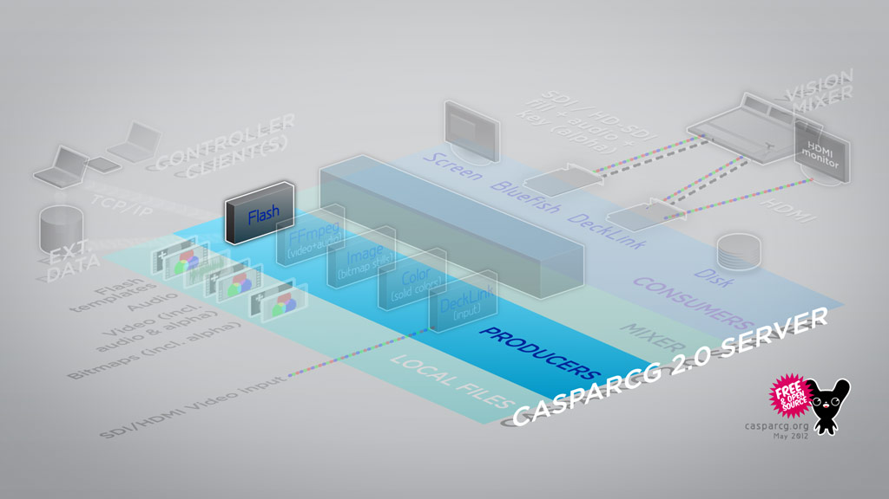

The Flash Producer uses Adobe’s Flash Player to play SWFs including full control over all dynamic content. You can even load multiple Flash files as layers that is stacked and composited by the CasparCG Server Mixer module and can then be controlled independently from a client program. Several Flash Player instances can also be loaded to get around the single-threaded nature of the current Flash Player.

Please see the AMCP commands section for a complete reference of the AMCP commands used to control this module.

## Availability

This producer should be considered deprecated. While it is still supported, it is likely that it will eventually be replaced by other producers such as the [HTML Producer](./html-producer.md) and [Scene Producer](./scene-producer.md)

It is only available on Windows builds.

As of 2.3.0, the flash producer is disabled by default to discourage use. It is still fully functional, but requires manually re-enabling flash in the CasparCG config and Windows.

## Supported Media

- .ft Flash template (a SWF that has gone through the TemplateGenerator.)
- .ct A zip-compressed folder that contains a Flash template together with media and XML data.
- .swf A regular SWF file.

## File Path

All files played by this producer must be placed in the template folder (by default C:\CasparCG\templates).

## Interlacing

In the current version of CasparCG Server, if the criteria for rendering with fields is met the Flash Producer will always renders with fields (interlacing.)

By changing the frame rate in the Flash Document properties inside Adobe's Flash Professional to twice the normal rate, the Flash Producer and a consumer will output interlaced dynamic output.

## Criteria for Rendering with Fields

When the Flash Producer is launched, it communicates with the consumer and receives three settings that is then used to setup the rendering:

- Whether the consumer is set to either progressive or fields-based rendering.
- What resolution the consumer is set to output.
- What frame rate the consumer is set to output.

## Diagnostics

```
flash[template-host | video-mode]
```

| Graph      | Description                                  | Scale |
| ---------- | -------------------------------------------- | ----- |
| frame-time | Time spent rendering the current frame.      | fps/2 |
| tick-time  | Time between rendering two frames.           | fps/2 |
| param      | The latest invoked Flash command.            | -     |
| late-frame | Frame was not ready in time and was skipped. | -     |
| sync       | Synced time between rendering two frames.    | fps/2 |

## TemplateHost

The TemplateHost is Flash Player instance(s) that load and play Flash templates inside CasparCG Server.

Each CasparCG channel loads all the Flash templates in the same instance of a TemplateHost. That instance of the TemplateHost can then play multiple Flash layers (not to be confused with channel layers.)

## Hosting

The TemplateHost loads the templates into a container and keep track of the different layers. There are also logic that handles the layers, e.g it’s possible to load a template into a currently occupied layer (like `LOADBG`). The Load command tries to cast the loaded file as an ICasparTemplate, and if it fails, it currently uses the DefaultTemplateAdapter assuming it is a 1.6 version of the template.

## Commands

The commands that are received from the CasparCG Server are handled by any of the command classes. The corresponding command class is instantiated and put into the command queue which makes sure that a command is finished before the execution of the next command.

## CasparCGComponents

A CasparCG component is a module that can receive data from a client (via the server). In the current version, the only included component is the CasparTextField which is a wrapper for the normal TextField class in flash which implements the CasparComponent interface. The dynamic textfields are automatically converted to CasparTextFields when the template is generated by the template generator, this is done by injecting a frame script:

```
registerComponent(new CasparTextField(f0));
```

The idea was to make it easy for developers to create custom CasparCG components, but the process of creating components for the Flash IDE is quite inconvenient and we have only created one of these components so far, the CasparImage component.

It is however very easy to create code based custom components. You only have to implement the ICasparComponent interface, and then call registerComponent and passing your instance to make it work. The registerComponent tells the ComponentDataBuffer (which stores data for instances that are not yet instantiated) that the component is ready to receive data. The data is then passed to the components SetData function as xml. This is normally not the current workflow, often developers override the SetData function in the document class and manually parse and populate their elements.

## Metadata

One really nice feature with the current version is that the template has the possibility to store metadata which can be accessed with the info `<template name>` command in the server. If you use the CasparTextfield or the CasparImage, metadata is automatically stored inside the template like this:

```
<template version="2.0.0" authorName="Andreas Jeansson" authorEmail="andreas.jeansson@somebroadcaster.se" templateInfo="Template info goes here" originalWidth="1920" originalHeight="1080" originalFrameRate="50">
 <components>
   <component name="CasparTextField">
     <property name="text" type="string" info="String data"/>
   </component>
   <component name="CasparImage">
     <property name="text" type="string" info="URL to the image to load (.png, .jpg, .gif)"/>
     <property name="x" type="number" info="X position offset"/>
     <property name="y" type="number" info="Y position offset"/>
     <property name="scale" type="number" info="The scale of the image (in percent)"/>
     <property name="mirrorX" type="boolean" info="If true the image is mirrored in the x axis"/>
     <property name="mirrorY" type="boolean" info="If true the image is mirrored in the y axis"/>
     <property name="opacity" type="number" info="The opacity of the image (in percent)"/>
     <property name="rotation" type="number" info="The rotation of the image (in degrees)"/>
     <property name="bitmap" type="string" info="URL to the image to load (.png, .jpg, .gif)"/>
   </component>
 </components>
 <keyframes>
   <keyframe name='outro'/>
 </keyframes>
 <instances>
   <instance name="f0" type="CasparTextField"/>
   <instance name="image1" type="CasparCGImage"/>
   <instance name="f1" type="CasparTextField"/>
 </instances>
</template>
```

This makes it possible for a client to create a custom interface for each template which makes much more user friendly to work with a template.

There is in theory a way to expose this information even from code based custom components, but it is not really convenient.

## Communication

The commands from the server are sent via the external interface and are handled as described above. Some commands return data, and this data is also returned via the external interface. There are also some events where the TemplateHost calls the server, this is when there is an error in the host or in the template (which will be displayed in the log by the CasparCG Server) and when there are no templates loaded (which will make the server kill the flash player and instantiate a new one the next time a template is added). There is also the traceToLog function which makes it possible to write arbitrary data from the template to the CasparCG log file. The data flow from CasparCG Server to template and back could be describes as this:

SetData command example:

```
Server --ExternalInterface--> TemplateHost --SetDataCommand instance --> ExternalCommandsBuffer --> template SetData function
```

TraceToLog example:

```
Template TraceToLog function --CasparTemplateEvent --> TemplateHost --ExternalInterface--> Server --> CasparCG Server log
```

To fully understand the architecture it is necessary to dive into the source files which can be found in the source code repository.

## Wish list for the future

Here are some points that should be investigated and hopefully implemented in the future versions.

### Performance:

- Investigate if we could use the gpu for rendering in some way
- Optimize code
- Check the possibility to load each template into a separate worker
- Investigate if we could find a way to boost the performance on the template rendering inside the TemplateHost (e.g. forcing bitmap caching on all templates or maybe using blitting). I don’t know what possibilities we have to affect the rendering on a low level.
- Investigate if there is any gains in using AIR
- Integrating the Adobe Scout in the template creation process

### Workflow:

- Make it possible to create a template without using the template generator, which would remove the need to use Flash professional.
- Make it easier for designers to create dynamic templates
- Simplify the use of custom components

### Compatibility:

- Adding support for swf files and make it possible to call public functions by using the invoke command
- Keeping the compatibility for 1.7 - 2.0 templates (ft-files) and .ct files

### Architectural:

- Automatically generated meta data without the template generator
- Make the TemplateHost convert the xml into native flash types that is defined by the component, removing the need for xml-parsing.
- Removing the Mixer since it is no longer needed
- Removing the support for 1.6 templates
- Rebuild the template to template communication (CommunicationManager) and maybe move this logic to the server (which would make it possible to easily implement template to client communication).
- Separating the TemplateHost from the template (in the current version they are very dependent).
- Investigate if the .ct logic should be moved to the server
