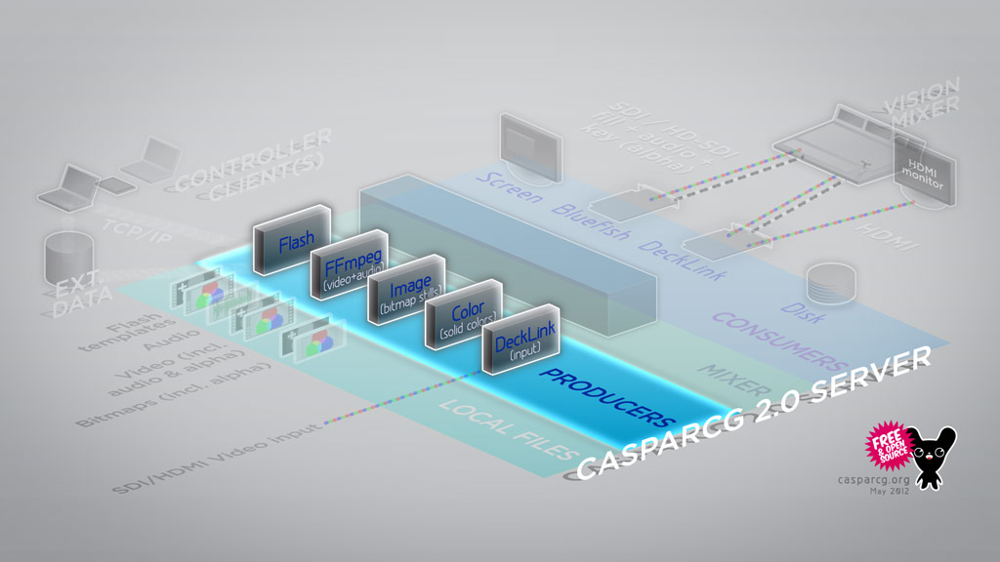

A producer is a CasparCG Server module for input and rendering of media content such as video, animations, images and audio. Each producer has different capabilities.

A producer listens for commands and data sent from a client controller, then loads and renders that media as a separate content layer into the Mixer Module and sends it to a consumer that displays that media in a variety of ways.
