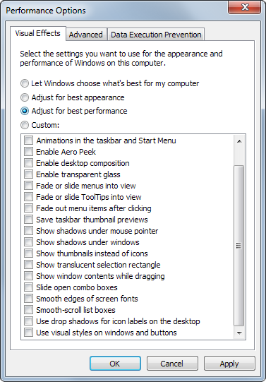

_Note: this page is outdated and should not be used as a reference any longer. For up to date information on system requirements please see the [casparcg/server](https://github.com/casparcg/server) readme file._

- Intel processor capable of using [SSSE3](http://en.wikipedia.org/wiki/SSSE3) instructions. While AMD processors probably work, CasparCG Server has only been tested on Intel processors.
- Windows 7 (64-bit) strongly recommended. CasparCG Server has also been used successfully on Windows 7 (32-bit) and Windows XP SP2 (32-bit only.)
  - **NOT SUPPORTED**: Windows 8, Windows 2003 Server and Windows Vista.
- A graphics card (GPU) capable of OpenGL 3.0 is required. We strongly recommend that you use a separate graphics card, and avoid using the built-in GPU that exists in many CPUs, since your performance will suffer.
- [Microsoft Visual C++ 2010 Redistributable Package](https://learn.microsoft.com/en-us/cpp/windows/latest-supported-vc-redist?view=msvc-170) must be installed.
- [Microsoft .NET Framework (version 4.0 or later)](http://go.microsoft.com/fwlink/?LinkId=225702) must be installed.
- For Flash template support:
  - Uninstall any previous version of the Adobe Flash Player using this file: [Flash Player uninstaller](http://download.macromedia.com/get/flashplayer/current/support/uninstall_flash_player.exe)
  - Download and unpack [Flash Player 11.8.800.94 stand-alone installer](http://download.macromedia.com/pub/flashplayer/installers/archive/fp_11.8.800.94_archive.zip)
  - Install Adobe Flash Player 11.8.800.94 from the unpacked archive: fp_11.8.800.94_archive\11_8_r800_94\flashplayer11_8r800_94_winax.exe
- For NewTek TriCaster iVGA support, please download and install the following driver: [NewTek iVGA driver](http://new.tk/NetworkSendRedist)

Make sure you turn off Windows' Aero theme and ClearType font smoothing as they have been known to interfere with transparency in Flash templates, and can also cause problems with Vsync when outputting to computer screens.

## System Recommendations

CasparCG Server runs on a multitude of old and new PC hardware, and has been tested and used with several brands and models without any problems.

Since we've created CasparCG Server mainly for our own productions, it might be interesting to know what we normally buy when we need to add to our 50+ CasparCG playout machines.

Our current standard configuration (updated in May 2013)

- 1 pc. HP Z420 4-core Xeon E5-1620 @ 3.6GHz with 8 GB ECC RAM. HP part number is B2B93UT or WM445ET#ABU.
- 1 pc. HP NVIDIA Quadro 2000 (1 GB) GPU (WS094AA)
- 2 pcs. OCZ VERTEX 3 2.5" 240GB SSD SATA/600 MLC (VTX3-25SAT3-240G)
- 2 pcs. BlackMagic Design DeckLink 4K Extreme SDI video cards for a two channel System, otherwise one card for fill and key is sufficent.
- 1 pc. Windows 7 Professional SP1 64-bit (make sure you turn off the default Aero theme and the ClearType font smoothing as may interfere with the OpenGL operation of CasparCG Server on some systems!)

#### Notes

The OS is installed on the standard 7200 rpm hard drive that comes with the system.

Media is placed on a software RAID-0 of the two SSDs.

We use DeckLink 4K Extreme cards for a few reasons:

- Bluefish cards are really nice and have a great API, but they are more expensive.
- DeckLink Quad' cards needs to be configured for separate fill and key output in CasparCG Server, while the DeckLink 4K Extreme cards automatically output the alpha as key to SDI.
- DeckLink 4K Extreme support 1080p50 (if you use one channel for fill and one for key) which the Quads don't.
- Most of our HD machines use DeckLink HD Extreme 3D (some use Bluefish Technologies Fury, and new machines are now being deployed with the DeckLink 4K Extreme cards) o we've tested them in production and know that there aren't any nasty bugs in the drivers, and we can swap cards without changing configuration.
  We've previously bought HP Z400 XE (6-core W3680 @ 3.33GHz with 6 GB RAM (KK788EA)) which are no longer available. Before that, we tested HP Z210 workstations, but a bug in the hardware/drivers prevented the machine from running both PCI-e lanes at 16x at the same time.

We've also tried the OCZ RevoDrive 3 X2 PCI-E X4 SSD 480 GB but they were instable (Windows would suddenly loose the drive) and the real speed was only half of the specification.

Make sure you turn off the default Aero theme in Windows as it interferes with the OpenGL operation of CasparCG Server!

### Processsors

CasparCG Server is tested and optimized for Intel Processors.

CasparCG Server takes advantage of multi-threading, running the producers and consumers in their own threads. A multi-core CPU is highly recommended.

The Adobe Flash component is single-threaded, meaning that CPU clock speed should be prioritized over more CPU cores; i.e. a 4-core 3.2 GHz CPU is preferable to an 8-core 3.0 GHz of the same CPU family. If you are playing several Flash templates you can run several instances of Adobe Flash Player and thereby gain multi-processor performance.

Make sure that your CPU and motherboard combination supports enough PCI-lanes, e.g. Desktop Sandy Bridge processors (i.e. not the Server versions) only supports 16 PCI-lanes, which does not run more than one 1080p HD channel.

### RAM

4 GB RAM (or more for 64-bit systems.) While CasparCG Server 2.0 is a 32-bit program, the fact that more RAM is available to the OS will improve the storage access of repeat readings through the built-in cache of the OS.

### Storage

Keep the OS and the CasparCG media on separate drives. If you plan to play and transition between any pre-rendered QuickTime movie files, the media drive for SD material should be at least a single SATA/300 SSD.

For HD video files we recommend striped (RAID0) SSD drives supporting SATA/600. PCI-E to SATA/600 cards seem to work fine if your system doesn't have SATA/600. We've had good experiences with Highpoint's RAID cards, less so with using the built-in RAID controllers of motherboards. Our current HD servers store all media content on fast SSDs.

If you use a video codec that creates smaller files (often without alpha support,) your storage performance requirements can drop significantly.

### Graphics Card (GPU)

CasparCG Server 2.0 requires OpenGL 3.0, so we encourage you to plan you hardware specifications with this consideration.

CasparCG Server is developed and tested on NVIDIA Quadro graphics cards. Other chipset may work, but have not been tested.

### Chassis

We recommend using chassis with several PCI-e slots, to enable the use of several video cards.

### OS

We recommend Windows 7 64-bit (any flavor.) While CasparCG Server 2.0 is currently a 32-bit program (v2.1 and later will require 64-bit), the fact that more RAM is available to the OS will improve the storage access of repeat readings through the built-in cache of the OS.

Make sure you turn off the default Aero theme in Windows as it interferes with the OpenGL operation of CasparCG Server!

Forums users have reported that CasparCG Server 2.0 runs without issue on Windows 8 provided Aero is turned off.

### SDI and HDMI Cards

You can have multiple video output cards in the same machine and address them independently. You can also mix DecklLink and Bluefish cards in the same machine, if you wish.

Please note: If you don't need to output SDI, HD-SDI or HDMI signals, you can use the Screen Consumer to play content to play content directly to your monitor(s), without any special video output card.

#### Bluefish Technologies

The current release of the CasparCG Server supports the Bluefish444 SDK from Bluefish Technologies and should work with all the manufacturer's cards. It has been tested and used with the following cards:

- DeepBlue LT
- Fidelity
- Epoch Horizon

All cards from Bluefish Technologies should be able to output separate fill and key to SDI.

Please see the [table of supported video cards](./supported-video-hardware.md).

##### Bluefish Card Configuration

The Bluefish Feature App that can be downloaded from Bluefish Technologies doesn't have all the features needed to set up the SDI output correctly. Make sure you download the drivers provided with the SDK which will let you choose scaling and color spaces.

When installing the driver, make sure you also install the ASIO driver and Symmetry.

#### BlackMagic Design / DeckLink

Please see the [table of supported video cards](./supported-video-hardware.md).

The current release of the CasparCG Server's DeckLink Consumer uses the DeckLink SDK and should support all output cards from Blackmagic Design.

If you want to play out with separate fill and key channels, you need to look for a card that has both A-SDI Out and B-SDI Out in the connection diagram/technical specs. You must also check the SD/HD capabilities of the B-channel (which is used for key output.)

The Blackmagic Design DeckLink HD Extreme 3D (discontinued) and DeckLink 4K Extreme cards are the only cards from BMD that output separate fill and key to SDI in CasparCG Server in HD in perfect sync. One HD Extreme 3D/4K Extreme will output one HD-SDI channel of fill and one HD-SDI channel of key. Output separate fill and key to HDMI from these cards is not supported. If you need to get synchronized, separated fill and key output via HDMI, you will need to add external SDI-to-HDMI converters.

Outputting fill and key on other BMD cards requires you to "manually" configure CasparCG Server to output an additional channel as "key-only" which cannot be fully guaranteed to stay in perfect sync, due to forces beyond our reach (the DeckLink API.)

### Genlock

Genlock is used to synchronize a signal to a common reference signal. It is supported for SDI and HD-SDI output from the Bluefish consumer and the DeckLink consumer.
